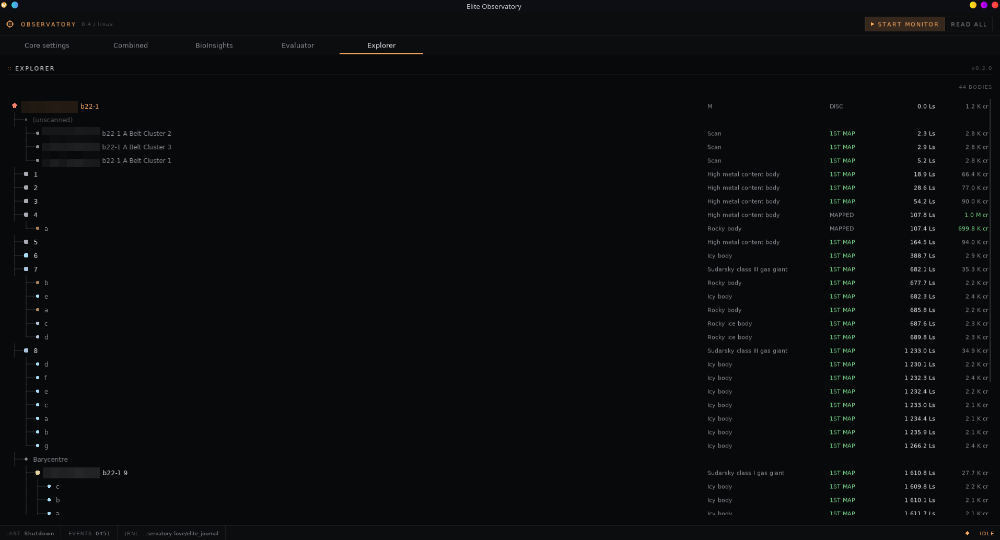
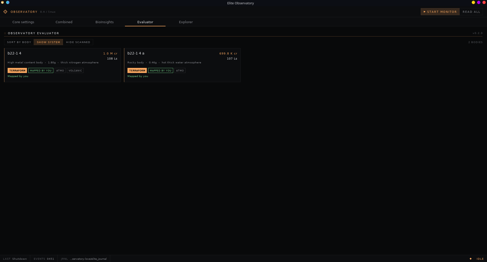
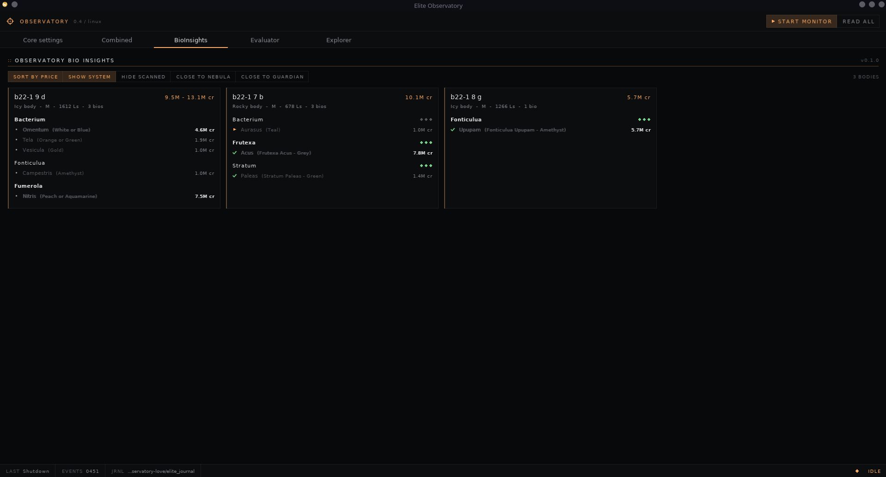
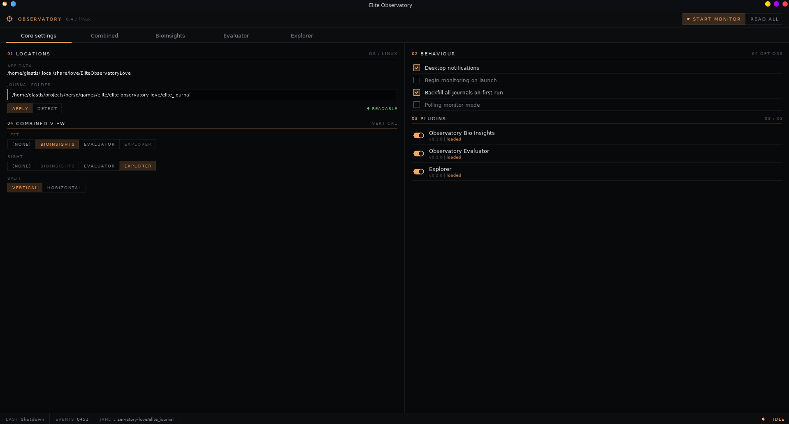
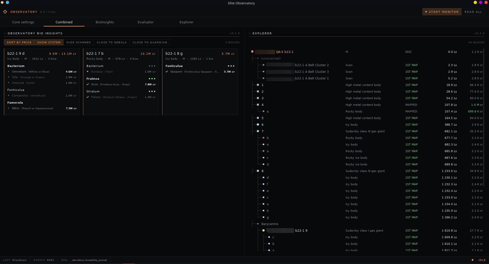

# Elite Observatory (LÖVE port)

A Lua/[LÖVE](https://love2d.org/) port of [Elite Observatory Core](https://observatory.xjph.net/).
The original C# / Windows Forms application has been re-implemented in pure
Lua so it runs unchanged on Windows and Linux (LÖVE 11.x).

## Features

Three plugins ship with the app.

### Explorer

Live tree view of the current system: stars, planets, moons, rings and
barycentres nested under their parent body, with scan distance and
discovery / mapping flags.

<p align="center"></p>

### Evaluator

Per-body scan value with terraforming and first-discovery / first-mapped
bonuses, plus the potential maximum once the body is mapped.

<p align="center"></p>

### Bio Insights

Biological sampling helper: lists detected species, their codex value
and the minimum sample distance to clear before the next sample.

<p align="center"></p>

### Core settings

Pick the journal folder (auto-detected on first launch, overridable
here), configure the Combined view slots and split orientation, and
review any plugin errors raised since startup.

<p align="center"></p>

## Combined view

The **Combined** tab shows two plugins side by side in a single pane —
for instance Explorer on the left and Evaluator on the right. Pick the
two plugins and the split orientation (vertical or horizontal) from
the Core settings tab; the choice is persisted across launches.

<p align="center"></p>

## Running

Prebuilt artifacts are published on the
[Releases page](https://github.com/Glastis/Elite-Observatory-Love/releases):

- **Windows** — download `EliteObservatory-vX.Y.Z-win64.zip`, extract,
  run `EliteObservatory.exe`.
- **Linux** — download `EliteObservatory-vX.Y.Z-x86_64.AppImage`,
  `chmod +x` it, run it.
- **Any LÖVE 11.x install** — download `EliteObservatory.love` and open
  it with LÖVE.

## Development

Run from source (needs [LÖVE 11.x](https://love2d.org/)):

```sh
love .
```

Press `F5` to reload plugins, `Esc` to quit.

Headless smoke check (CI-friendly):

```sh
love . --smoke                          # uses the auto-detected journal folder
love . --smoke --journal /path/to/dir   # forces a specific journal folder
```

Pure-Lua unit tests (no LÖVE runtime needed, any Lua 5.x or LuaJIT) cover
`paths`, `journal_reader`, `log_monitor` and the `evaluator` /
`bioinsights` plugins:

```sh
lua tests/run.lua
```

## Building

`build.sh` produces all three release artifacts (`.love`, Windows ZIP
and Linux AppImage) in a single pass. It downloads LÖVE and
`appimagetool` into `build/cache/` (cached across runs) and writes the
output to `dist/`.

```sh
./build.sh                                      # default LÖVE 11.5, version from `git describe`
LOVE_VERSION=11.5 APP_VERSION=v0.2.0 ./build.sh # override either
```

Required host tools: `zip`, `unzip`, `curl`, `find`, `file`.

## Writing a plugin

Plugins live under `plugins/<id>/init.lua` and return a table. Every
callback below is optional — declare only what you need.

```lua
local Plugin = {
    id               = "my-plugin",
    name             = "My Plugin",
    short_name       = "MP",
    version          = "0.1.0",
    grid             = { columns = { "Time", "Detail" }, rows = {} },
    default_settings = { notify_on_jump = true },
}

local core_ref

local function on_fsd_jump(plugin, entry)
    table.insert(plugin.grid.rows, {
        ["Time"]   = entry.timestamp,
        ["Detail"] = "Jumped to " .. (entry.StarSystem or "?"),
    })
    if plugin.settings.notify_on_jump then
        core_ref:send_notification({
            title  = "Jump",
            detail = entry.StarSystem,
        })
    end
end

local EVENT_HANDLERS = {
    FSDJump = on_fsd_jump,
}

function Plugin:load(core)
    core_ref = core
end

function Plugin:journal_event(entry)
    if not entry or not entry.event then return end
    local handler = EVENT_HANDLERS[entry.event]
    if handler then handler(self, entry) end
end

return Plugin
```

| Callback                            | When it fires                                |
| ----------------------------------- | -------------------------------------------- |
| `load(core)`                        | Once at startup, with the core API           |
| `journal_event(entry)`              | For each parsed journal line                 |
| `status_change(status)`             | When `Status.json` changes                   |
| `log_monitor_state_changed(change)` | When the file watcher state changes          |
| `on_notification(args)`             | For every notification dispatched            |
| `observatory_ready()`               | Once the initial journal replay completes    |
| `draw_view(state, x, y, w, h)`      | Custom rendering instead of the default grid |
| `row_count_label()`                 | Override the row count badge                 |

A plugin renders either through `grid` (default tabular view) or by
implementing `draw_view` for fully custom rendering — see
[`plugins/example/init.lua`](plugins/example/init.lua) for a complete
reference. The core API is documented in
[`observatory/core.lua`](observatory/core.lua).

## Credits

This is a Lua/LÖVE port of
[Elite Observatory Core](https://observatory.xjph.net/) by xjph — all
the analysis logic, journal-handling design and plugin philosophy come
straight from the original C# project. Huge thanks to the upstream
author for years of work on it.

The **Evaluator** and **Bio Insights** plugins are heavily inspired by
[edjp.colacube.net/observatory](https://edjp.colacube.net/observatory),
whose scan-value and biological-sampling tooling shaped what these
plugins do. Honestly their versions are still noticeably better than
mine — the only reason I rewrote them here is that the originals don't
run well on Linux.

`lib/json.lua` is the MIT-licensed [rxi/json.lua](https://github.com/rxi/json.lua).
